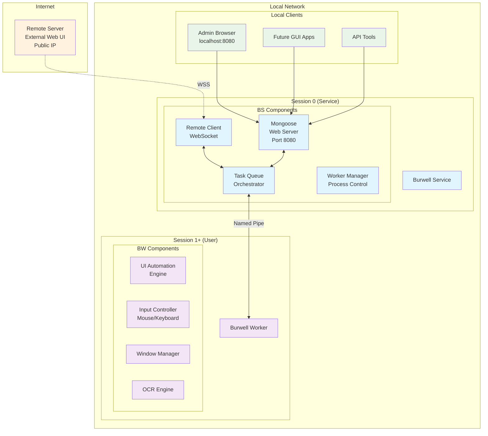
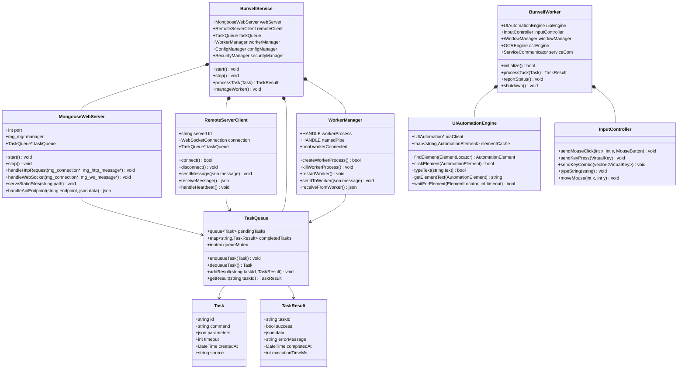
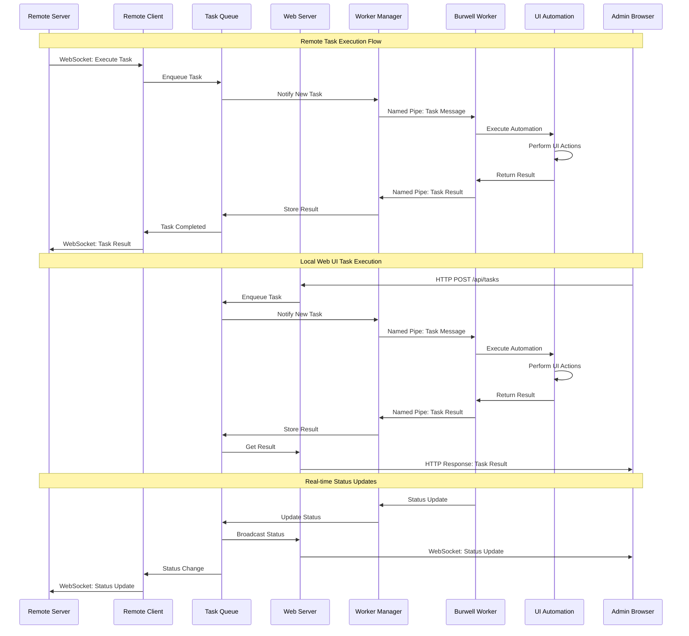
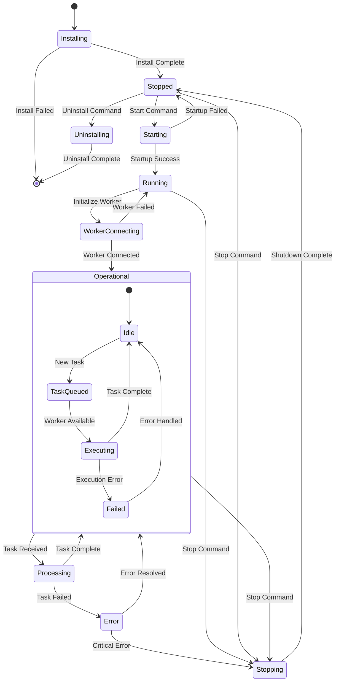
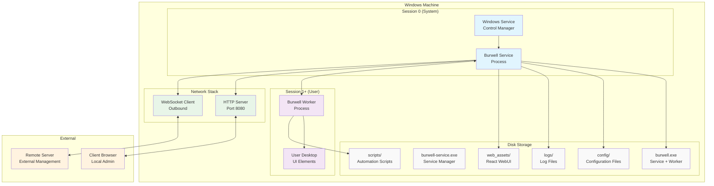
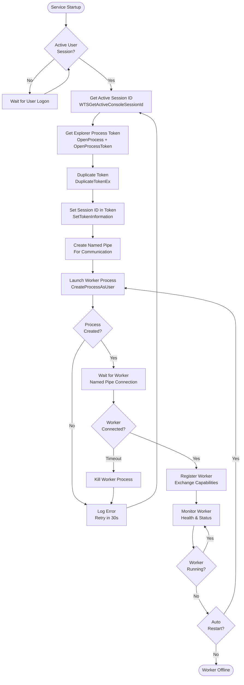
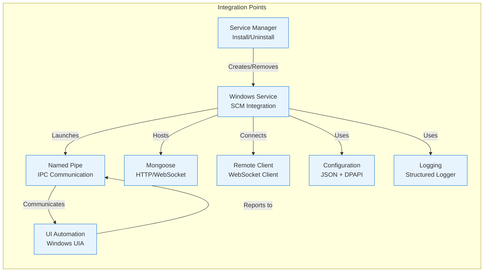

# Burwell UML Diagrams

## High-Level Component Diagram

## Class Diagram - Core Architecture

## Sequence Diagram - Task Execution Flow

## State Diagram - Service Lifecycle

## Deployment Diagram

## Activity Diagram - Worker Process Creation

## Component Integration Points

